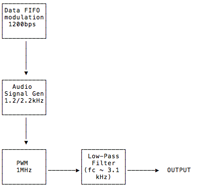

README
===

The overall goal of this project is to create an APRS beacon device using the [HamWing carrier board](https://github.com/W8LID/HamWing) by [W8LID](https://twitter.com/w8lid).

To do this, this project implements an AFSK "modem" via a low-pass filtered PWM signal.
I'm using an [Adafruit Feather RP2040 board](https://learn.adafruit.com/adafruit-feather-rp2040-pico) as the microcontroller in this project.
The sine wave is created by applying PWM output to a 3.1 kHz low-pass filter.
Via software it is able to produce 2-FSK at 1200 bps using [Bell 202](https://en.wikipedia.org/wiki/Bell_202_modem) (-ish) 1200 Hz/2200 Hz tones.

Block Diagram
---

Higher-level features are near the top lower-level are near the bottom.
The hardware PWM at 1MHz is driven by a 64-sample wave table that alters the duty cycle from 0 to 100%.

Definitions & Concepts
---

- **Sampling period**
  The voltage generated by the PWM wave in the interval between two interrupts will be a constant value and this time period can be called _sampling period_.
- **PWM cycle**
  The _duty cycle_ of the PWM, this is equivalent to the PWM off time + PWM on time.
  There will be many PWM cycles per sampling period.

The duty cycle of the PWM is increased in a sinusoidal way (e.g. 5%, 10%, 25%, etc.) at each sampling time (timer interrupt/callback).

Equations and variables
---

### Pulse Width Modulation

The RP2040 has a built-in PWM peripheral that uses the system clock at full speed (no dividers).
This yields about 125 MHz to work with.
The PWM peripheral is controlled by two variables:

`COUNTER_TOP` 16-bit value that controls when the auto-incrementing counter rolls over. The PWM frequency then is given by:

$$ f_{pwm} = \frac{f_{sys}}{COUNTER\_TOP + 1} $$

Note: If you look at the datasheet, I'm not using phase-correct PWM nor am I using any divisors, so other values in the denominator are 1.

`pwm_level` is the duty cycle of the PWM signal.
When the auto-incrementing counter reaches `pwm_level`, the PWM output goes low.
`pwm_level` is scaled to `COUNTER_TOP`, so that `COUNTER_TOP/2` yields a 50% duty cycle.

`wav` is a table of 64 8-bit samples of an ideal sine wave.
This is what will make up our actual output signal.

### Audio Signal

#### Space Tone

Now we have to deal with generating the audio signal.
This involves determining the correct sampling period mentioned above.
We have 64 samples for our sine wave.
The higher frequency in Bell 202 is, zero (0) or _space_ (as in [mark and space](https://en.wikipedia.org/wiki/Mark_and_space)) and it is 2,200 Hz.
We have to "play back" 64 samples per cycle, which happens 2,200 times per second.
If $T_A$ is *actual* sampling period then:

$$ 2200 Hz = \frac{1}{64 T_A} $$
$$ T_A = \frac{1}{64 * 2200 Hz} $$
$$ T_A \approx 7.102 \mu s $$

Our interrupt should happen every 7 microseconds or so.

It's annoying to try to nail that frequency exactly.
The Pico can easily set periodic tasks (interrupts) based on a whole number of microseconds.
It's not clear to me right now how I'd *directly* set an interrupt to go off each 7.102 us.
So, enter [Direct Digital Synthesis](https://hackaday.com/2016/02/12/embed-with-elliot-audio-playback-with-direct-digital-synthesis/).
It took me a bit to grok the idea but it's roughly, subdivide a convenient periodic interrupt interval into many steps.
Then on each interrupt an appropriate number of these smaller units are added into a *phase accumulator* so that overall (on average) the code steps through the sample table at the correct rate.
If the frequency should be higher, add more steps on each interrupt.
To go slower, add fewer steps each time.

To put numbers to it, I want to know how many steps I should *increment* for each interrupt.
I'm aiming for a 2,200Hz (f) sound, 64 samples (N), a 20us interrupt period ($T_C$), and 2048 steps in the phase accumulator (A).
$T_A$ represents the *ideal* sample period, it's split into 2048 steps.
If 7.102us is 2048 steps, then 10us will be a bit more than that:

$$ increment = A\frac{T_C}{T_A} = 2048\frac{20\mu s}{7.102\mu s} = 5767 $$

#### Mark Tone

To derive variables for the _mark_ tone (representing a binary 1) of 1,200 Hz we can run through similar math.

$$ 1200 Hz = \frac{1}{64 T_A} $$
$$ T_A = \frac{1}{64 * 1200 Hz} $$
$$ T_A \approx 13 \mu s $$

Then, by similar reasoning as above, I came up with:

$$ increment = A\frac{T_C}{T_A} = 2048\frac{20\mu s}{13.02\mu s} = 3146 $$

References
---
1. [How to Generate Sine Wave using PWM with PIC Microcontroller](https://www.engineersgarage.com/how-to-generate-sine-wave-using-pwm-with-pic-microcontroller-part-19-25/)
2. [EMBED WITH ELLIOT: AUDIO PLAYBACK WITH DIRECT DIGITAL SYNTHESIS](https://hackaday.com/2016/02/12/embed-with-elliot-audio-playback-with-direct-digital-synthesis/)
